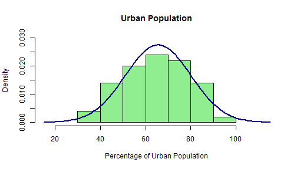

### Introduction

With data from the *1975 World Almanac* and *Statistical Abstracts of the United States*, the [USArrests](http://stat.ethz.ch/R-manual/R-devel/library/datasets/html/USArrests.html) data set within the R [datasets](http://stat.ethz.ch/R-manual/R-patched/library/datasets/html/00Index.html) package brings together 1973 data on Assault, Rape & Murder arrests by state.  

Using RStudio's [Shiny](http://shiny.rstudio.com/) package, I have created an interactive chart to view this data by state.  

I chose this data set for the challenge of creating a choropleth, and because the data is easily accessible to R (this package is included in a standard R installation).

--- .class #id 

### App Instructions

I have created an interactive chart which dynamically updates based on the crime chosen. The chart displays which states have the highest per capita number of arrests for a given crime.  

The app will also calculate the average and standard deviation of the distribution that you select.  

To use the web app, select a given crime from the dropdown widget. The chart will automatically update based on your selection.  

--- .class #id

### Urban Population Histogram

The USArrests data set contains one variable which I chose not to include in the app because it is different than the other data types. I'll include it here.

--- .class #id

### Conclusion

My app is located at [lenwood.shinyapps.io/USArrests](https://lenwood.shinyapps.io/USArrests/).

The code for this presentation & my shiny app is visible at my [Github Repository](https://github.com/lenwood/USArrests).

